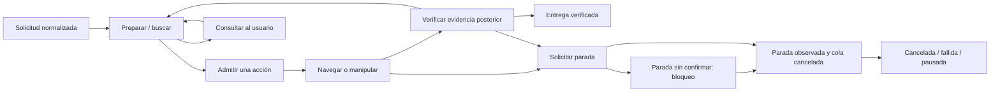

# F4 — Gestor y verificación de misiones
> Plataforma actual: AlohaMini1. Las cifras de cierre del 15/09 que aparecen más abajo corresponden al robot anterior; véase la [validación de la migración](/docs/development/asistencia_domestica_modular/migracion_alohamini1.md). Las pruebas del gestor siguen vigentes; no se transfieren garantías mecánicas ni de manipulación.

Fecha: 15/09/2026. Alcance: software, navegación en MuJoCo y ejecutores artificiales explícitos. Brazo de referencia: **derecho**, confirmado por el usuario para estas pruebas. La elección del brazo físico sigue pendiente de alcance y calibración.

F4 implementa el ciclo de misión sin depender de un VLM. No entrena ACT, no acciona brazos/pinzas reales y no acredita una transferencia física. Se revisó `artifacts/cronograma_tesis/cronograma_actualizado.xlsx` como referencia; no se modificó.

## Implementación y correspondencia con el plan

| Requisito F4 | Implementación y evidencia |
| --- | --- |
| Preparación, búsqueda, navegación, manipulación, verificación, consulta y terminación | [MissionManager](/dimos/experimental/household_assistant/mission.py) y [contratos de ejecución](/dimos/experimental/household_assistant/mission_contracts.py). La secuencia programada está separada del gestor. |
| Despacho único y peticiones idempotentes | Registro de bindings por ejecutor/operación/origen; una sola acción activa y una cola de comandos. Repetir un ID con el mismo contenido no reejecuta; reutilizarlo con otro contenido se rechaza. |
| Precondiciones actuales y decisiones obsoletas | [Requisitos ejecutables](/dimos/experimental/household_assistant/mission_verification.py), evidencia temporal de F1, cámaras requeridas y revisión de escena. Se comprueba otra vez al admitir una propuesta. |
| Cancelación independiente de llamadas lentas | [Módulo DimOS](/dimos/experimental/household_assistant/mission_module.py): hilo de control/watchdog separado del adaptador; comunicación mediante colas. Una llamada espacial bloqueada no bloquea el gestor. |
| Pausa y preparación posterior | `paused` exige parada observada. `resume` comprueba actuadores y carga, vacía la secuencia completada y prepara acciones nuevas. No continúa un bloque motor interrumpido. |
| Verificación y retención | Llegada y parada; agarre; `loaded_home`; retención durante navegación/alineación; objeto liberado, estable y dentro de la región de entrega. Resultado `success/failure/unknown`. |
| Dobles de manipulación y fallos | [ArtificialMissionExecutor](/dimos/experimental/household_assistant/mission_simulation.py). El registro F4 rechaza bindings físicos y orígenes artificiales mal etiquetados. |
| Trazas | Solicitud, propuesta admitida, evidencia de precondiciones, ejecutor/origen, resultados, verificación, consultas y cancelaciones en JSONL. Una respuesta humana a una ambigüedad se distingue de la selección automática. No se registran razonamientos internos de modelos. |

El blueprint nuevo es household-mission-sim (`dimos/robot/alohamini1/blueprints/household_mission_sim.py`, ruta histórica). Compone el stack F2 con `HouseholdMissionModule`; usa el AlohaMini1 suministrado con articulaciones bloqueadas en cero CAD. El registro de blueprints se regeneró mediante su prueba oficial.

## Estados y garantías



- Un mensaje `finished` solo inicia la verificación. La evidencia de cada postcondición debe haberse capturado **después** del fin del ejecutor.
- Se comprueban base, elevador y ambos brazos detenidos. Para una misión nueva también se exigen pinzas vacías; una carga residual no se borra con un reinicio lógico de solicitud.
- Si se transporta carga, las señales de sujeción y postura se comprueban durante el desplazamiento. Un dato falso, desconocido u obsoleto provoca solicitud de parada.
- La confirmación del adaptador de que canceló su cola no basta: hace falta evidencia sensorial posterior a la solicitud. `stop_unconfirmed` mantiene cerrada la admisión hasta que llegue esa evidencia; no se convierte en éxito por timeout.
- La verificación de parada tiene un campo separado (`stop_verification`), para no confundir una parada correcta con una misión exitosa.
- El watchdog controla cámaras requeridas, antigüedad/desconexión del mundo y timeout de ejecución. Un error del adaptador/control produce un fallo con el mismo requisito de parada.
- El productor de `WorldFrame` debe incrementar `revision` cuando cambie el contexto relevante. El adaptador F4 lo hace ante cambios de hechos y pose; el contrato no sustituye a un detector físico de cambios de escena.

La exclusión cubre el flujo registrado del gestor. Las RPC genéricas de desarrollo de otros módulos siguen existiendo: el futuro agente/MCP debe utilizar el gestor como único canal de ejecución, tal como exige F5.

## Qué se está simulando y qué se está sustituyendo

| Componente de la demostración F4 | Procedencia |
| --- | --- |
| Modelo original AlohaMini1, movimiento de base y navegación | MuJoCo + VoxelGridMapper, CostMapper, A*, MovementManager y HouseholdSpatialModule existentes. |
| Pose y parada de la base | Muestras de localización del simulador y ventana de velocidades; `origin=simulation`, `mujoco_ground_truth`. No SLAM físico. |
| Captura en estación | La acción de observación espera una captura reciente de F2, posterior a su inicio. |
| Identidad/visibilidad del objeto y asociación con región, alineación, cámaras requeridas del contrato, brazos/elevador/pinza y retención | Fixture explícito con `origin=test`. No se deducen del RGB en esta demostración nominal. |
| Recogida, retorno cargado y colocación | Cambios de estado artificiales. **No se mueve la malla de la botella ni se envían comandos articulares.** |
| Supervisor | Secuencia programada F4, no VLM. |

Esta distinción es deliberada: el entregable de F4 es el gestor con navegación simulada y manipulación artificial verificable. No se presenta el recorrido como integración visual autónoma completa ni como entrenamiento o validación de manipulación AlohaMini1.

## Relación con percepción y memoria F3

Se reutilizan los contratos de evidencia y verificación, `BoundedSearch` y `HouseholdMemory`:

- [visibility_from_visual](/dimos/experimental/household_assistant/mission_visual.py) convierte candidatos F3 en hechos de visibilidad **solo con asociaciones explícitas candidato–objeto**. Conserva la evidencia y hora de captura; las instancias no asociadas permanecen desconocidas. No genera hechos de ubicación 3D, agarre ni pertenencia a una región. Una asociación de región requiere evidencia adicional antes de admitir la recogida.
- La secuencia F4 reutiliza la búsqueda acotada de F3 para realizar hasta dos observaciones y consultar ante ambigüedad o falta de evidencia. Se restringe a la región de recogida autorizada por la misión F1. No cambia silenciosamente el origen ni el dominio de manipulación al encontrar una pista en otra región.
- [record_verified_placement](/dimos/experimental/household_assistant/mission_sequence.py) permite actualizar la memoria F3 después del éxito del gestor; vuelve a comprobar las postcondiciones completas y conserva el origen de la evidencia. Se prueba con un almacén real DimOS/Chroma y su journal.

La demostración nominal utiliza asociaciones artificiales. El blueprint F4 no levanta por sí solo un detector YOLO/CLIP ni un almacén persistente de memoria: estas interfaces quedan comprobadas por separado. F5 debe conectar el contexto visual/memoria efectivo al supervisor; la identidad y verificación sensorial físicas continúan en F8/F9. Una observación antigua recuperada de memoria nunca se refresca cambiando solamente la fecha de su envoltorio.

## Reproducción

Desde la raíz del repositorio, con el entorno ya preparado:

```bash
source .venv/bin/activate
python -m dimos.experimental.household_assistant.demo_mission_cases --output .ignore.f4/casos_nuevos
```

Este comando genera 14 escenarios y trazas con reloj controlado y origen artificial. El directorio de salida debe ser nuevo para no sobrescribir evidencias.

Para navegación real dentro de MuJoCo:

```bash
MUJOCO_GL=egl python -m dimos.experimental.household_assistant.demo_mission --scenario nominal --output .ignore.f4/nominal_nuevo
MUJOCO_GL=egl python -m dimos.experimental.household_assistant.demo_mission --scenario cancel --output .ignore.f4/cancelacion_nueva
MUJOCO_GL=egl python -m dimos.experimental.household_assistant.demo_mission --scenario blocked --output .ignore.f4/bloqueo_nuevo
```

Cada ejecución inicia y detiene sus módulos, usa transporte Zenoh y guarda `report.json`, `events.jsonl` y el último `WorldFrame`. Los imports del stack también inicializan transporte LCM, por lo que se necesita permitir sockets locales. No requiere la RTX ni servicios remotos.

El módulo ofrece RPC para `submit_request`, `get_mission_status`, `get_mission_events`, `get_world_frame`, `propose_action`, `choose_target`, `cancel_mission` y `resume_mission`. La solicitud es JSON normalizado según `MissionRequest`; todavía no se interpreta lenguaje libre. `automatic_sequence=False` permite ensayar propuestas externas controladas. La exposición `@skill`/MCP pertenece a F5, y la interfaz de usuario a F6.

Pruebas focalizadas sin cargar plugins ROS ajenos a este paquete:

```bash
PYTEST_DISABLE_PLUGIN_AUTOLOAD=1 pytest -o addopts='' -p pytest_mock -p pytest_timeout -p pytest_env.plugin -p pytest_asyncio.plugin dimos/experimental/household_assistant/test_mission.py dimos/experimental/household_assistant/test_mission_module.py dimos/experimental/household_assistant/test_semantic_memory.py -q
```

Para comprobar el registro ya generado y las regresiones del paquete:

```bash
CI=1 PYTEST_DISABLE_PLUGIN_AUTOLOAD=1 pytest -o addopts='' -p pytest_mock -p pytest_timeout -p pytest_env.plugin -p pytest_asyncio.plugin dimos/robot/test_all_blueprints_generation.py dimos/experimental/household_assistant -q
```

El entorno local carga automáticamente `launch_pytest`, que falla por una dependencia `lark` ausente. Se utilizaron explícitamente los plugins necesarios para estas pruebas; no se instalaron dependencias ROS adicionales. Algunas pruebas anteriores importan blueprints y necesitan sockets locales incluso al recolectarse.

## Evidencia de cierre y siguiente fase

El [registro de validación F4](/docs/development/asistencia_domestica_modular/historico_alohamini2/fase_4_validacion.json) identifica casos, comandos, resultados, versiones y hashes. Las trazas detalladas permanecen en `.ignore.f4/`; los resultados resumidos y sus hashes quedan versionados en documentación.

Resultados del cierre del 15/09/2026:

| Comprobación | Resultado |
| --- | --- |
| Regresiones del paquete y registro de blueprints | 91 pruebas aprobadas. |
| Tipado de la implementación nueva | Mypy sin errores en 10 archivos. |
| Escenarios con reloj controlado y ejecutores artificiales | 14/14 alcanzaron el estado esperado, incluyendo fallos y consultas. |
| Misión nominal con navegación MuJoCo | `succeeded`, con ocho acciones verificadas. |
| Cancelación durante desplazamiento con carga artificial | `cancelled`, parada confirmada en 0,411 s; deriva posterior inferior a 0,001 m durante la ventana de 1 s. |
| Paso bloqueado en MuJoCo | `failed`, tras timeout de navegación y parada confirmada; no se declaró entrega. |

Las tres ejecuciones nativas finales corresponden a los mismos hashes de implementación. La latencia de cancelación es una medición de ese ensayo simulado, no una garantía temporal para hardware. Los 14 casos controlados no equivalen a 14 misiones físicas ni a 14 recorridos MuJoCo.

La revisión `pre-commit` aprobó licencia, Ruff, formato, JSON y enlaces. El único fallo fue el control global de archivos grandes: el cronograma existente `artifacts/cronograma_tesis/cronograma_actualizado.xlsx` ocupa 132 KB frente al límite de 75 KB. Ese control revisa todos los archivos registrados incluso al pasar `--files`. Se confirmó que el Excel es idéntico byte a byte a `HEAD`; no se alteró el cronograma ni la política global de tamaño. Esta observación queda pendiente para el mantenimiento del repositorio y no corresponde a un fallo funcional de F4.

Los casos controlados cubren misión nominal, ausencia explícita, ambigüedad, incertidumbre visual, agarre fallido, fin motor sin agarre verificado, timeout, pérdida de retención/postura, destino ocupado, desconexión, parada no confirmada, cancelación y pausa/repreparación. Las pruebas adicionales comprueban idempotencia concurrente, revisión obsoleta, cámaras ausentes, evidencia antigua, cola de inicio cancelada, resultados tardíos, actualizaciones de memoria y bloqueo de un adaptador.

F4 no cierra C1/C2 físicas. El siguiente trabajo es **F5: un VLM local real con imágenes efectivamente recibidas, contexto de memoria y propuestas que pasen por este gestor**, manteniendo sus controles de cancelación y verificación. Después continúan interfaz F6, pipeline ACT F7 y validación física F8/F9.
