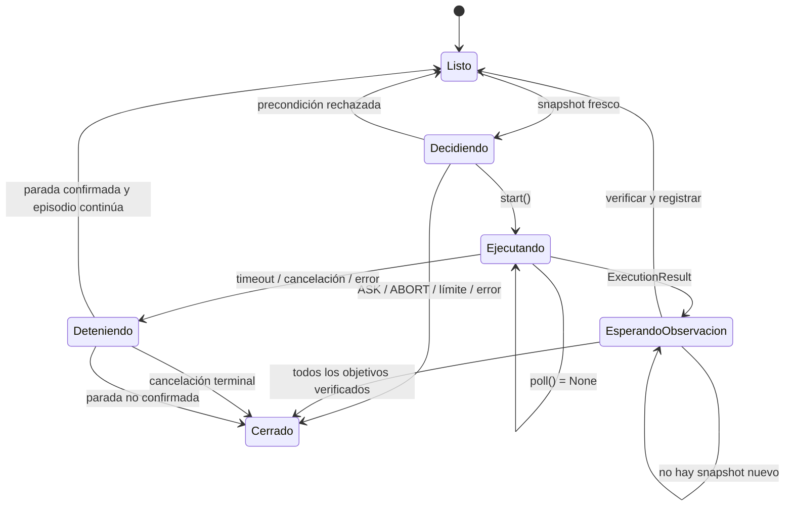
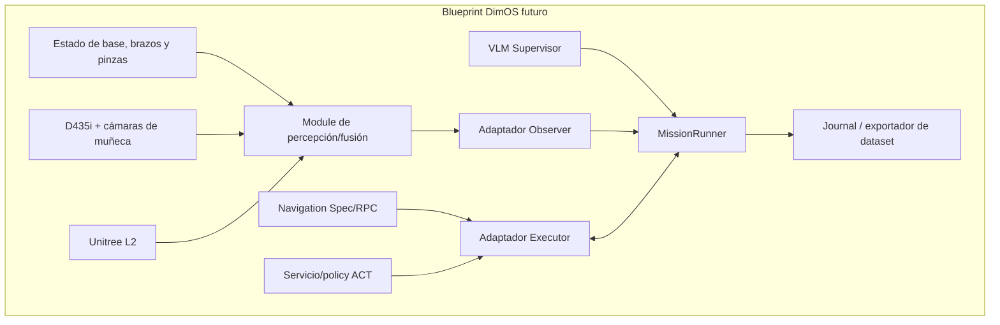

Esta guía explica todos los archivos de
`dimos/experimental/domestic_assistance`, cómo colaboran entre sí y cómo deben
conectarse en el futuro con DimOS, ACT, MuJoCo y el robot físico. El estado
descrito corresponde al 7 de septiembre de 2026.

El paquete actual es un **núcleo experimental ejecutable**, pero todavía no es
un Blueprint ni un conjunto de `Module` de DimOS. Su objetivo es fijar primero
la semántica de las misiones, los límites de seguridad, la verificación y el
formato de los rollouts. Los drivers concretos deben entrar después mediante
adaptadores que implementen las interfaces existentes.

## 1. Idea central

El sistema no considera que una acción tuvo éxito solo porque terminó un motor
o una policy ACT. Separa cuatro preguntas:

1. ¿Qué acción semántica propuso el supervisor?
2. ¿Era seguro y válido despacharla con el estado observado?
3. ¿El ejecutor terminó la operación?
4. ¿Una observación posterior demuestra el efecto esperado?

Por ejemplo, una policy ACT puede terminar una secuencia de agarre y devolver
`SUCCESS`, pero eso no demuestra por sí solo que la prenda quedó sujeta. El
verificador necesita una observación posterior con evidencia fresca del objeto
y de la pinza.

```mermaid
flowchart LR
    Sensors[Percepción y estado del robot] --> Observer[Observer]
    Observer --> Context[DecisionContext]
    Context --> Supervisor[Supervisor]
    Supervisor --> Decision[Decision + candidatos]
    Decision --> Preconditions[Verifier: precondiciones]
    Preconditions -->|válida| Executor[Executor DimOS / ACT]
    Preconditions -->|rechazada| Journal[EpisodeJournal]
    Executor --> ExecResult[ExecutionResult]
    ExecResult --> Wait[Esperar observación posterior]
    Sensors --> Wait
    Wait --> Semantic[Verifier: postcondición]
    Semantic --> History[HistoryEntry]
    History --> Journal
    History --> Context
    Journal --> Audit[audit_episode]
```



Las responsabilidades están deliberadamente separadas:

| Componente | Decide | Actúa | Observa | Verifica | Registra |
| --- | --- | --- | --- | --- | --- |
| Supervisor | Sí | No | Lee contexto | No | No directamente |
| Runner | Orquesta | Despacha | Solicita snapshots | Invoca reglas | Sí |
| Executor | No | Sí | No debería inferir éxito semántico | Solo reporta finalización | Aporta evidencia |
| Observer | No | No | Sí | No | Aporta evidencia |
| Verifier | No | No | Lee hechos | Sí | Devuelve resultado verificable |
| Journal/Auditor | No | No | Conserva snapshots | Recalcula consistencia | Sí |

## 2. Mapa del directorio

```text
domestic_assistance/
├── contracts.py                  Datos y reglas estructurales compartidas
├── interfaces.py                 Fronteras entre núcleo y adaptadores
├── observations.py               Buffer del último snapshot perceptivo
├── supervisor.py                 Supervisor secuencial de referencia
├── runner.py                     Máquina de estados de un episodio
├── verification.py               Precondiciones y postcondiciones semánticas
├── rollouts.py                   Journal JSONL y auditoría reproducible
├── testing_executor.py           Mundo determinista exclusivo para pruebas
├── demo_mission.py               Ejecutable local de demostración
├── configs/
│   ├── recoger_ropa.json
│   ├── recoger_ropa_nominal.json
│   ├── preparar_bandeja.json
│   └── preparar_bandeja_nominal.json
├── conftest.py                   Montaje reutilizable de pruebas
├── test_contracts.py
├── test_observations.py
├── test_runner.py
├── test_rollouts.py
├── test_configs.py
└── test_testing_executor.py
```

No hay un `__init__.py` específico porque el repositorio utiliza paquetes de
namespace. Los archivos se importan con
`dimos.experimental.domestic_assistance.<módulo>`.

## 3. `contracts.py`: lenguaje común del experimento

[`contracts.py`](/dimos/experimental/domestic_assistance/contracts.py) contiene
modelos Pydantic inmutables. Es la base del paquete: runner, supervisor,
ejecutor, observador, verificador, configuraciones y journal intercambian estos
mismos tipos.

Todos heredan de `Contract`, que aplica tres decisiones importantes:

- `extra="forbid"`: un campo inesperado causa error en vez de ignorarse.
- `frozen=True`: una instancia validada no se modifica accidentalmente.
- `allow_inf_nan=False`: tiempos y valores numéricos deben ser finitos.

### Tipos básicos y enumeraciones

- `Identifier` restringe IDs a letras, números, punto, guion y guion bajo. Esto
  evita que una acción incluya rutas o comandos arbitrarios.
- `Origin` distingue evidencia de `test`, `simulation` y `physical`. Una
  observación artificial no puede presentarse como evidencia física.
- `Outcome` representa `SUCCESS`, `FAILED`, `TIMEOUT`, `UNKNOWN` o `CANCELLED`.
- `DispatchStatus` dice si la acción llegó realmente al ejecutor. Evita llamar
  “fallo del robot” a un rechazo local de precondición.
- `Arm`, `Holder` y `GripperState` modelan los dos brazos y permiten representar
  un objeto sostenido por izquierda, derecha o ambas pinzas.
- `NavigationState` describe el estado de la navegación.
- `SpatialRelation` expresa relaciones semánticas: `IN`, `ON`, `AT` y `NEAR`.
- `EvidenceKind` identifica la clase de fuente que respalda un hecho.

### Evidencia y acciones

`EvidenceRef` apunta a la evidencia de un hecho: fuente, instante, URI opcional y
hash SHA-256 opcional. Si hay hash debe existir una URI. En hardware, una URI
puede referir a una imagen, un fragmento de rosbag o un archivo de telemetría.

`Action` es un vocabulario cerrado:

| Acción | Argumentos exactos | Propósito |
| --- | --- | --- |
| `NAVIGATE` | `zone` | Mover la base a una zona semántica. |
| `SEARCH` | `object_id` | Buscar u observar un objeto. |
| `PICK` | `object_id` | Agarrar un objeto. |
| `PLACE` | objeto, zona, destino y relación | Depositar un objeto con una relación espacial concreta. |
| `VERIFY` | objeto, zona, destino y relación | Obtener o comprobar evidencia explícita del objetivo. |
| `ASK` | `reason` | Solicitar ayuda y terminar el episodio como asistido. |
| `ABORT` | `reason` | Abortar de forma deliberada. |

La validación exige exactamente esos argumentos. Por diseño, el supervisor no
puede generar posiciones articulares, código Python o comandos de driver. La
traducción de `PICK` a una policy ACT concreta pertenece al ejecutor.

### Misión y objetivos

- `MissionTarget` registra destinos como cesto, bandeja o superficie.
- `PlacementTarget` une una zona, un destino y una relación.
- `Goal` declara dónde debe terminar un objeto y si requiere un brazo o los dos.
- `Mission` contiene instrucción, zonas, destinos y objetivos. Valida unicidad y
  rechaza acciones que mencionen entidades ajenas a la misión.

Una zona responde “¿en qué región está?”, mientras que una relación responde
“¿cómo está colocado?”. Para una camiseta no basta `zona_cesto`: también debe
cumplirse `camiseta IN cesto_ropa`.

### Observación bimanual

Una `Observation` es un snapshot completo compuesto por:

- `RobotObservation`: zona, base detenida y estado de navegación.
- exactamente dos `GripperObservation`, una por brazo;
- cero o más `ObjectObservation`;
- keyframes opcionales.

Cada hecho conocido debe tener evidencia y su propio `observed_at`. Esto permite
que un snapshot recién empaquetado contenga, por ejemplo, una percepción de
objeto antigua; el verificador puede detectar esa antigüedad.

`ObjectObservation.relations` conserva hechos positivos o negativos. Por
ejemplo, `present=false` para `vaso_1 ON bandeja` es evidencia de que la
postcondición falla; ausencia total de esa relación significa que no se sabe.

La validación cruza el estado de objetos y pinzas. Si el objeto dice que está en
la pinza izquierda pero la pinza está vacía, se rechaza todo el snapshot.

### Decisión, ejecución e historial

- `Candidate` registra una acción candidata, rango de generación, probabilidad
  opcional y valor Q opcional.
- `Decision` contiene entre uno y tres candidatos, la selección y
  `BehaviorMetadata`. La seleccionada tiene que estar entre los candidatos.
- `CandidateAssessment` guarda si cada candidata pasó las precondiciones.
- `ExecutionResult` solo describe lo que reportó el ejecutor.
- `VerificationResult` describe la interpretación semántica de la evidencia.
- `HistoryEntry` une despacho, ejecución, verificación y duración sin fusionar
  sus significados.
- `DecisionContext` es la entrada reproducible del supervisor: observación,
  historial previo y número de reintentos.

Esta estructura prepara la comparación de métodos M0–M4: se pueden conservar
las candidatas, sus probabilidades o valores y la política que produjo cada
decisión, sin contaminar la observación con el resultado final del episodio.

### Límites, manifiestos y escenarios

`Limits` fija presupuestos de decisiones, reintentos y tiempos. Distingue edad
del snapshot (`max_observation_age_s`) de edad de cada hecho
(`max_fact_age_s`).

`ExperimentManifest` congela las versiones del código, supervisor, ejecutor y
verificador, además de hashes de configuración y prompt. `RunMetadata` añade
identidad de episodio, escenario, sesión, split, semilla y origen.

`Scenario` describe una realización reproducible de una misión:

- posición inicial del robot y de los objetos;
- perturbaciones previstas;
- checklist de reset físico;
- secuencia nominal de referencia.

`Intervention` registra ayuda humana. `EpisodeSummary` separa:

- `mission_success`: el objetivo físico se cumplió;
- `autonomous_success`: se cumplió sin petición de ayuda ni intervención;
- `experiment_valid`: el episodio puede incluirse en el análisis experimental.

Estas tres dimensiones no deben tratarse como una sola etiqueta.

## 4. `interfaces.py`: puertos de integración

[`interfaces.py`](/dimos/experimental/domestic_assistance/interfaces.py) define
`Protocol` estructurales. Una clase no necesita heredar de ellos: basta con que
implemente la misma API.

### `Executor`

Es el único puerto que controla capacidades físicas:

- `start()` acepta una acción y retorna inmediatamente;
- `poll()` informa si continúa o devuelve un `ExecutionResult`;
- `cancel()` solicita la parada;
- `is_idle()` confirma que actuadores y acción están detenidos;
- `origin` declara si es prueba, simulación o robot físico.

En la integración real, un adaptador puede traducir `NAVIGATE` a un RPC de
DimOS y `PICK`/`PLACE` a policies ACT. Debe serializar los recursos físicos y no
bloquear indefinidamente dentro de estas llamadas.

### `Observer`

`observe()` devuelve el último snapshot completo. `observe_after(t)` solo
devuelve uno capturado estrictamente después de `t`. El segundo método es la
garantía que impide verificar una acción con la misma imagen que existía antes
de ejecutarla.

### `Supervisor`

Recibe `Mission` y `DecisionContext` y devuelve una `Decision`. No ejecuta
herramientas. Un futuro Qwen/VLM debe implementar este puerto con inferencia
acotada y salida validada por los contratos.

### `Verifier` y `Clock`

`Verifier` separa precondiciones, verificación de acción y éxito completo. Su
versión queda congelada en el manifiesto. `Clock` hace inyectables el reloj de
pared y el monotónico, lo que permite probar timeouts sin esperar tiempo real.

## 5. `observations.py`: entrega segura de percepción

[`observations.py`](/dimos/experimental/domestic_assistance/observations.py)
implementa `ObservationBuffer`, un intercambio thread-safe entre productores de
percepción y el runner.

El productor publica snapshots completos con `publish()`. El buffer:

- rechaza orígenes incompatibles;
- rechaza timestamps iguales o anteriores al último snapshot;
- nunca convierte la ausencia de percepción en un “mundo vacío conocido”;
- nunca cambia el timestamp de una observación vieja para hacerla parecer nueva.

No realiza fusión sensorial. En hardware, otro módulo debe sincronizar D435i,
cámaras de muñeca, LiDAR, odometría, estado de brazos y detectores, derivar los
hechos y entonces publicar una `Observation` coherente.

## 6. `supervisor.py`: baseline de decisión

[`supervisor.py`](/dimos/experimental/domestic_assistance/supervisor.py) contiene
`ScriptedSupervisor`, una política determinista que consume una secuencia de
acciones.

Después de cada resultado:

- avanza si la verificación tuvo éxito;
- no avanza ante `search_not_found`, para no fingir que encontró el objeto;
- emite `ASK` ante `UNKNOWN`;
- repite una acción fallida hasta que el runner alcance el límite de reintentos;
- emite `ABORT` si agota el guion sin que el runner certifique la misión.

Cada decisión contiene una única candidata y se identifica como
`policy=scripted-v2`, `method=scripted`. Esto no pretende resolver planificación;
sirve como baseline reproducible y ejercita exactamente el contrato que deberá
cumplir el VLM.

`transfer_script()` genera el patrón genérico navegar–buscar–agarrar–navegar–
colocar–verificar para objetivos independientes. El escenario de bandeja no usa
este generador porque necesita relaciones anidadas y mover la bandeja al final.

## 7. `verification.py`: significado observable de éxito

[`verification.py`](/dimos/experimental/domestic_assistance/verification.py)
implementa `ObservedFactsVerifier`, actualmente versión `observed-facts-v2`.
Debe permanecer igual para todos los métodos comparados dentro de una campaña.

### Antes del despacho

`precondition_error()` impide manipular si la base no está observada y detenida.
Para `PICK`, exige objeto visible, fresco, en la zona del robot, no sostenido y
suficientes pinzas vacías. Para una bandeja bimanual exige dos.

Para `PLACE`, exige que el robot esté en la zona destino y que objeto y pinzas
demuestren de forma fresca el agarre. Una bandeja bimanual debe aparecer en ambas
pinzas.

Las acciones de navegación y búsqueda no tienen todavía precondiciones
específicas adicionales.

### Después de la ejecución

`verify_action()` primero conserva cualquier fallo, timeout o incertidumbre
reportada por el ejecutor. Si este reportó éxito, exige un snapshot posterior:

- `NAVIGATE`: robot en la zona, base detenida y evidencia de llegada fresca.
- `SEARCH`: visibilidad verdadera produce `search_found`; falsa produce el éxito
  operativo `search_not_found`; desconocida produce `UNKNOWN`.
- `PICK`: objeto y las pinzas correspondientes concuerdan en que está sostenido.
- `PLACE` y `VERIFY`: relación espacial fresca, positiva y objeto liberado.

Un `SEARCH` sin hallazgo puede estar correctamente ejecutado aunque no permita
avanzar la misión. Esta diferencia entre “la acción se realizó correctamente” y
“logró progreso hacia la meta” es importante para entrenar y evaluar políticas.

`mission_complete()` exige que todos los objetos estén liberados, en su zona y
con su relación final fresca, además de una base detenida. El runner añade el
requisito de un `VERIFY` exitoso explícito para cada objetivo.

Las funciones del final del archivo son wrappers de compatibilidad alrededor de
`DEFAULT_VERIFIER`.

## 8. `runner.py`: ciclo de vida del episodio

[`runner.py`](/dimos/experimental/domestic_assistance/runner.py) es el
orquestador central. `MissionRunner.tick()` avanza como máximo un paso pequeño y
debe invocarse periódicamente.



### Construcción

El constructor recibe misión, metadatos, ejecutor, observador, supervisor,
journal, límites, reloj y verificador. Comprueba que origen, ID de episodio y
versión del verificador coincidan. Al construirse registra `EpisodeStarted`.

### Cuando no hay una acción activa

El runner comprueba cancelación, timeout de misión, límite de decisiones e
inactividad del ejecutor. Luego:

1. obtiene y valida una observación;
2. construye el contexto con todo el historial y los reintentos;
3. solicita candidatas al supervisor;
4. valida todas las candidatas contra la misión;
5. calcula las precondiciones de todas y las registra;
6. despacha únicamente la seleccionada si es elegible.

`ASK` y `ABORT` son decisiones terminales, no llamadas al robot. Un rechazo de
precondición tampoco llega al ejecutor.

### Cuando hay una acción activa

El runner consulta `poll()`. Al recibir el resultado guarda el instante absoluto
de finalización y pasa a esperar `observe_after(executor_completed_at)`. Solo una
observación estrictamente posterior puede verificar el efecto.

Si no llega antes de `verification_timeout_s`, un supuesto éxito del ejecutor se
convierte en `UNKNOWN`. El timeout o la cancelación de una acción llama
`cancel()` y espera `is_idle()` antes de permitir cualquier despacho posterior.
Si no puede confirmar la parada, termina con `CANCEL_UNCONFIRMED`.

### Éxito e intervención

Un objeto entra en el conjunto de objetivos verificados únicamente tras un
`VERIFY` exitoso que coincida exactamente con su meta. En observaciones
posteriores se vuelve a comprobar que esos objetivos sigan satisfechos. La
misión termina con éxito cuando todos continúan satisfechos y
`mission_complete()` también lo confirma.

`record_intervention()` conserva ayuda verbal, teleoperación, contacto físico o
parada de emergencia. Puede existir éxito físico, pero ya no éxito autónomo.
`mark_invalid()` excluye un episodio del análisis sin borrar su evidencia.

El `RLock` serializa una instancia, no todo el hardware. Un adaptador físico aún
necesita un lease global, watchdog y parada de emergencia independientes.

## 9. `rollouts.py`: registro y auditoría

[`rollouts.py`](/dimos/experimental/domestic_assistance/rollouts.py) define los
eventos del journal JSONL schema v2:

| Evento | Contenido |
| --- | --- |
| `episode_started` | Misión, metadata y límites congelados. |
| `decision_started` | Contexto exacto, candidatas, selección y evaluaciones. |
| `decision_finished` | Historial de despacho/ejecución/verificación y snapshot posterior. |
| `intervention_recorded` | Ayuda humana con instante y evidencia. |
| `episode_invalidated` | Motivo de exclusión experimental. |
| `episode_finished` | Resumen y etiquetas terminales. |

`EpisodeJournal` crea el archivo con modo exclusivo: nunca sobrescribe un
episodio existente. Cada línea se vacía a disco con `flush` y `fsync`. Si el
proceso cae, se conservan las líneas anteriores y la auditoría informa que el
episodio está truncado; no se reanuda automáticamente.

`audit_episode()` vuelve a leer y validar todo el archivo. Entre otras cosas,
comprueba:

- secuencia y tiempo monotónico;
- contexto igual al historial realmente registrado;
- correspondencia de candidatas y precondiciones;
- acción elegida igual a la terminada;
- snapshot posterior a la finalización del ejecutor;
- éxito semántico reproducible con el verificador congelado;
- número y duración de intervenciones;
- archivos y hashes de evidencia;
- `SUCCESS` únicamente si todos los objetivos fueron verificados.

Una auditoría `complete=true` significa “registro íntegro y consistente”, no
“misión exitosa”. Un fracaso bien documentado debe producir una auditoría
completa.

## 10. `testing_executor.py`: doble determinista

[`testing_executor.py`](/dimos/experimental/domestic_assistance/testing_executor.py)
no es un simulador físico. Implementa `Executor`, `Observer` y `Clock` con un
estado simbólico en memoria para probar el ciclo completo rápidamente.

`ManualClock` separa tiempo monotónico y epoch y avanza solo cuando la prueba lo
ordena. Así se prueban deadlines sin pausas reales.

`DeterministicExecutor` mantiene zona del robot, ubicación de objetos,
relaciones y contenido de ambas pinzas. Modela efectos ideales:

- navegar mueve al robot, objetos sostenidos y sus dependientes;
- agarrar ocupa una o dos pinzas;
- colocar libera pinzas y crea la relación solicitada;
- mover la bandeja también mueve simbólicamente los objetos apoyados en ella.

Puede inyectar `failed`, `unknown`, `timeout` o `cancel_unconfirmed` en una
acción numerada. Toda su evidencia lleva `Origin.TEST`/`EvidenceKind.TEST`, por
lo que no puede utilizarse como resultado de MuJoCo o hardware.

## 11. `demo_mission.py`: demostración de extremo a extremo

[`demo_mission.py`](/dimos/experimental/domestic_assistance/demo_mission.py) es
el punto de entrada local. Carga una misión y su escenario nominal, calcula sus
hashes, construye manifiesto, ejecutor, supervisor, journal y runner, avanza el
reloj artificial y finalmente audita el JSONL.

Ejemplos:

```bash
.venv/bin/python -m dimos.experimental.domestic_assistance.demo_mission \
  --task recoger_ropa --output /tmp/dimos-domestic-demo

.venv/bin/python -m dimos.experimental.domestic_assistance.demo_mission \
  --task preparar_bandeja --output /tmp/dimos-domestic-demo

.venv/bin/python -m dimos.experimental.domestic_assistance.demo_mission \
  --task recoger_ropa --fault timeout --output /tmp/dimos-domestic-demo
```

`--code-version` permite registrar una revisión conocida. El valor por defecto
marca correctamente el árbol como desarrollo sin commit. Que esta demo pase no
demuestra dinámica, percepción, capacidad de ACT ni seguridad física.

## 12. Configuraciones

Las configuraciones separan **qué debe lograrse** (`Mission`) de **cómo comienza
una repetición concreta** (`Scenario`). Esta separación permite conservar la
misma misión mientras se varía disposición, semilla, perturbaciones y split.

### `configs/recoger_ropa.json`

[`recoger_ropa.json`](/dimos/experimental/domestic_assistance/configs/recoger_ropa.json)
define cuatro zonas, el cesto y tres prendas. Cada objetivo exige que la prenda
termine en `zona_cesto` y con relación `IN cesto_ropa`.

No contiene posiciones métricas ni marcas físicas. Los nombres de zona son IDs
semánticos; un futuro registro de navegación debe traducirlos a poses o áreas
del mapa.

### `configs/recoger_ropa_nominal.json`

[`recoger_ropa_nominal.json`](/dimos/experimental/domestic_assistance/configs/recoger_ropa_nominal.json)
ubica camiseta, pantalón y toalla en tres zonas próximas. Incluye checklist de
reset y 18 acciones: seis por prenda. La secuencia explícita facilita reproducir
el baseline y compararlo con un supervisor aprendido.

El escenario no afirma que la ropa tenga una pose rígida. En el experimento
físico, las marcas y fotografías del reset deben definir variaciones permitidas
de posición, orientación y deformación.

### `configs/preparar_bandeja.json`

[`preparar_bandeja.json`](/dimos/experimental/domestic_assistance/configs/preparar_bandeja.json)
declara mesa, bandeja y superficie elevada. Los objetivos finales son:

- `vaso_1 ON bandeja` en la zona de cocina;
- `plato_1 ON bandeja` en la zona de cocina;
- `bandeja ON superficie_cocina` en la zona de cocina.

La bandeja se marca `bimanual`; sus agarres requieren ambas pinzas. El vaso y el
plato continúan siendo de una sola pinza.

### `configs/preparar_bandeja_nominal.json`

[`preparar_bandeja_nominal.json`](/dimos/experimental/domestic_assistance/configs/preparar_bandeja_nominal.json)
contiene 19 acciones. Primero coloca la bandeja en la mesa, carga un vaso y un
plato, vuelve a agarrar la bandeja con ambos brazos, la mueve a la cocina y
verifica las tres relaciones finales.

Las relaciones son anidadas: al transportar la bandeja, vaso y plato cambian de
zona con ella y deben seguir `ON bandeja`. En el robot real esto debe observarse,
no inferirse únicamente porque la base se movió.

El piloto usa un vaso y un plato para permanecer dentro de
`Limits.max_decisions=20`. Para ampliar el número de objetos hay que cambiar y
registrar el límite, además de definir si se agrupan verificaciones o se usa un
plan más eficiente.

## 13. Archivos de pruebas

Los tests forman parte de la especificación ejecutable del paquete.

### `conftest.py`

[`domestic_assistance/conftest.py`](/dimos/experimental/domestic_assistance/conftest.py)
ofrece el fixture `make_rig`. Crea una misión pequeña de trasladar un libro,
reloj manual, ejecutor, supervisor, journal y runner. `Rig.finish()` avanza hasta
cien ticks y falla si el episodio no termina. Este montaje reduce duplicación,
pero no se usa en producción.

### `test_contracts.py`

[`test_contracts.py`](/dimos/experimental/domestic_assistance/test_contracts.py)
comprueba el perímetro de datos: rechaza acciones arbitrarias, argumentos
incorrectos, selección fuera de candidatas, etiquetas terminales dentro de la
observación, keyframes futuros, metas inválidas, éxito autónomo asistido, hechos
sin evidencia y contradicciones bimanuales.

### `test_observations.py`

[`test_observations.py`](/dimos/experimental/domestic_assistance/test_observations.py)
demuestra que el buffer no inventa un mundo vacío, no acepta frames tardíos, no
mezcla orígenes y solo devuelve snapshots estrictamente posteriores.

### `test_runner.py`

[`test_runner.py`](/dimos/experimental/domestic_assistance/test_runner.py) prueba
el ciclo de vida nominal y las rutas de fallo: timeout, cancelación confirmada o
no confirmada, límite de misión, reintentos, decisión inválida, observación
vieja, inferencia lenta, falta de evidencia de agarre, fallo de disco,
precondiciones, espera postacción e intervención humana.

Es el archivo más importante al cambiar la máquina de estados: una modificación
en despacho, seguridad o terminación debe venir acompañada de un caso aquí.

### `test_rollouts.py`

[`test_rollouts.py`](/dimos/experimental/domestic_assistance/test_rollouts.py)
verifica que un episodio no se sobrescriba y que el auditor detecte journals
truncados, secuencias corruptas, evidencia faltante y etiquetas de éxito
fabricadas.

### `test_configs.py`

[`test_configs.py`](/dimos/experimental/domestic_assistance/test_configs.py)
carga los cuatro JSON como contratos reales. Comprueba correspondencia
misión–escenario, máximo de 20 acciones, `IN` para el cesto, relaciones anidadas
de bandeja y manipulación bimanual.

### `test_testing_executor.py`

[`test_testing_executor.py`](/dimos/experimental/domestic_assistance/test_testing_executor.py)
confirma que un objeto bimanual ocupa ambas pinzas y que el snapshot resultante
es consistente.

Los tests del paquete se ejecutan con:

```bash
.venv/bin/pytest dimos/experimental/domestic_assistance -q
```

## 14. Cómo se integrará con DimOS

La frontera recomendada conserva el núcleo y añade módulos alrededor:



Una posible distribución de responsabilidades es:

1. **Módulo de percepción:** consume streams, sincroniza timestamps y publica
   hechos con evidencia en `ObservationBuffer`.
2. **Adaptador de navegación:** convierte zonas semánticas a objetivos de mapa,
   consulta el RPC de navegación y solo reporta parada del subsistema.
3. **Adaptador ACT:** selecciona checkpoint y cámaras para `PICK`/`PLACE`, inicia
   inferencia/ejecución no bloqueante y expone cancelación.
4. **Ejecutor compuesto:** arbitra base y brazos para que exista una sola acción
   física activa y una única respuesta a `is_idle()`.
5. **Supervisor VLM:** genera hasta tres acciones semánticas; no recibe acceso a
   comandos articulares ni llama directamente a skills.
6. **Módulo dueño del episodio:** crea `MissionRunner`, llama `tick()` con una
   frecuencia fija, registra intervenciones y gestiona cierre seguro.

En DimOS, los RPC entre módulos deberían expresarse con `Spec` tipados. Los
streams son adecuados para percepción; los RPC son adecuados para iniciar,
consultar y cancelar acciones. El Blueprint debe tener un único dueño del
ejecutor para evitar despachos simultáneos desde el VLM, una skill MCP y el
runner.

## 15. Cómo seguir una decisión en el código

Para depurar una acción concreta:

1. Buscar el `decision_id` en el JSONL.
2. Leer su `decision_started`: contiene exactamente lo que vio el supervisor,
   sus candidatas y la evaluación de precondiciones.
3. Comprobar `dispatch_status` en `decision_finished`.
4. Si fue `EXECUTED`, separar `executor_result` de `verification_result`.
5. Revisar `executor_completed_at` y confirmar que `next_observation.captured_at`
   sea posterior.
6. Abrir los `EvidenceRef` y keyframes asociados.
7. Ejecutar `audit_episode()` para detectar inconsistencias estructurales.

Este recorrido permite saber si el fallo fue de planificación, precondición,
driver/policy, percepción, verificación o registro.

## 16. Mejoras recomendadas

La **Fase 0 de referencia congelada** se completó el 8 de septiembre de 2026.
Sus versiones, hashes, rollouts golden e invariantes se describen en
[Fase 0: referencia congelada](/docs/development/tesis/baseline_fase_0.md). Esta
referencia es infraestructura de regresión y no debe confundirse con el método
experimental M0 del supervisor.

### Prioridad inmediata: integración sin debilitar contratos

1. Implementar adaptadores reales de navegación, ACT y observación, manteniendo
   el runner independiente de SDKs.
2. Añadir lease de hardware, watchdog externo y parada de emergencia. El timeout
   del runner no puede interrumpir una llamada de driver bloqueada.
3. Crear un Blueprint mínimo de simulación con el mismo `Executor` y `Observer`
   que luego se usarán en hardware.
4. Capturar keyframes reales antes/después de cada habilidad y relacionarlos con
   calibración, cámara, episodio y decisión.

### Mejoras del modelo de datos

- Separar las propiedades de manipulación del `Goal`. Un futuro `ObjectSpec`
  podría indicar bimanualidad, brazo preferido, fragilidad, tamaño y familia de
  policy; actualmente `manipulation_mode` está ligado a la meta final.
- Versionar explícitamente los JSON de misión y escenario y centralizar su carga
  en un `ConfigBundle` que calcule hashes y valide ambos juntos.
- Validar en `Scenario` que no haya colocaciones iniciales duplicadas y decidir
  si todos los objetos de la misión deben aparecer obligatoriamente.
- Añadir registro separado de poses/tolerancias para zonas y destinos. No deben
  incrustarse coordenadas de un mapa concreto en la misión semántica.
- Definir dominio de reloj, `received_at` y política de sincronización. Un único
  `float` de epoch no basta si cámaras, LiDAR y controladores usan relojes
  distintos.
- Considerar confianza/calidad de hechos perceptivos y calibrar los umbrales del
  verificador sin permitir que cada método experimental use reglas diferentes.

### Mejoras del runner y supervisor

- Convertir la inferencia del supervisor en `start/poll/cancel` o ejecutarla en
  un worker con deadline real. La interfaz actual pide inferencia acotada, pero
  una implementación síncrona defectuosa todavía puede bloquear un `tick()`.
- Añadir precondiciones para `NAVIGATE`, `SEARCH` y `VERIFY`, por ejemplo mapa
  localizado, cámara disponible, destino observable y recursos no ocupados.
- Tratar `search_not_found` con una estrategia explícita de recuperación:
  cambiar viewpoint, recorrer una subzona o marcar el objeto como ausente. El
  supervisor de prueba simplemente repite hasta el límite.
- Valorar un tipo específico para decisiones de control `ASK`/`ABORT`. Hoy se
  registran correctamente como `TERMINAL_CONTROL`, pero su
  `VerificationResult=FAILED` puede resultar confuso en análisis estadístico.

### Mejoras de auditoría y datos de tesis

- Registrar el hash de la implementación/configuración del verificador, no solo
  su string de versión. El auditor actual reproduce únicamente
  `DEFAULT_VERIFIER`.
- Añadir un registro de versiones de verificadores para poder auditar journals
  antiguos después de introducir `observed-facts-v3`.
- Definir política de privacidad, retención y anonimización para imágenes del
  hogar antes de capturar datos físicos.
- Añadir métricas derivadas sin modificar el journal original: éxito por misión,
  éxito autónomo, intervenciones, tiempo, reintentos, fallos por skill y cobertura
  de evidencia.
- Reservar `split_group` por disposición física u hogar, evitando que variantes
  casi idénticas aparezcan a la vez en entrenamiento y evaluación.

### Mejoras específicas de las misiones

- **Ropa:** definir variaciones reproducibles de deformación y oclusión, criterio
  observable de “levantada”, capacidad/ocupación del cesto y casos donde dos
  prendas se solapan.
- **Bandeja:** verificar estabilidad y derribo durante el transporte, no solo la
  relación final; añadir límites de inclinación y trayectorias de base suaves.
- Antes de aumentar vasos y platos, decidir si cada objeto requiere un `VERIFY`
  individual o si una observación global de la bandeja puede respaldar varias
  metas con evidencia trazable.
- Incorporar perturbaciones reales a los escenarios: agarre vacío, objeto
  movido, destino ocupado y timeout de navegación. Los tipos existen, pero los
  escenarios nominales actuales dejan `perturbations=[]`.

## 17. Qué no demuestra todavía esta arquitectura

El paquete ya permite razonar y auditar decisiones, pero no demuestra por sí
solo:

- que ACT generalice a prendas, vasos, platos o bandejas;
- que la percepción detecte agarres, liberaciones y relaciones `IN`/`ON`;
- que el robot pueda navegar mientras transporta objetos de forma estable;
- que el URDF, límites, extrínsecos y controladores físicos estén calibrados;
- que un VLM alcance los deadlines o supere al baseline;
- que una ejecución `Origin.TEST` constituya evidencia experimental física.

La arquitectura sirve precisamente para que esas afirmaciones futuras se
midan, se separen y queden respaldadas por evidencia, en lugar de deducirse de
que una secuencia de comandos terminó.

## 18. Documentos relacionados

- [Plan de tesis de asistencia doméstica](/docs/development/plan_tesis_asistencia_domestica.md)
- [Estado de la implementación inicial](/docs/development/tesis/implementacion_inicial.md)
- [Hardware objetivo AlohaMini2](/docs/development/tesis/hardware_objetivo.md)
- [Sistema de módulos de DimOS](/docs/usage/modules.md)
- [Composición mediante Blueprints](/docs/usage/blueprints.md)
- [Guía de testing](/docs/development/testing.md)
